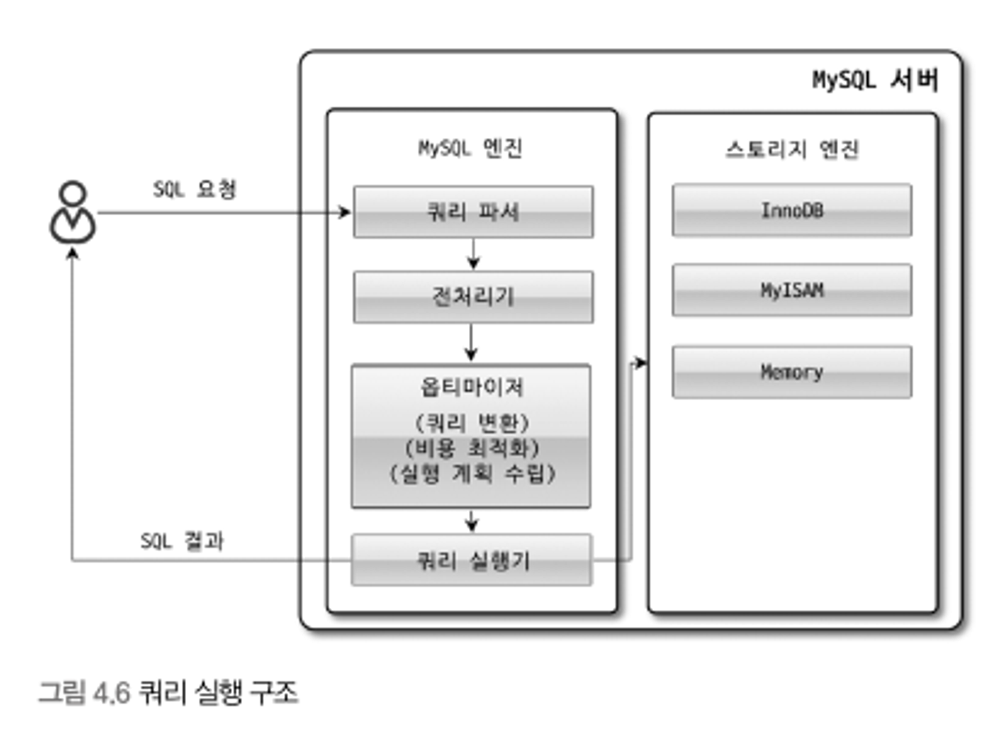

# 4.1 MySQL 엔진 아키텍처

- MySQL은 다른 DBMS와는 약간의 차이가 존재한다. 이러한 차이 때문에 이점도 있으며 단점 또한 존재하게 된다.

 

## 4.1.1 MySQL의 전체 구조

<p align="center">

- MySQL은 대부분의 프로그래밍 언어로부터의 접근 방법을 지원(JDBC, ODBC, .NET 등등)
- MySQL 서버는 MySQL 엔진과 스토리지 엔진으로 구분

### MySQL 엔진

- 클라이언트로부터의 접속 및 쿼리 요청을 처리하는 **커넥션 핸들러**와 **SQL 파서** 및 **전처리기**, 쿼리의 최적화된 실행을 위한 **옵티마이저** 등으로 구성

### 스토리지 엔진

- 실질적인 처리를 담당하는 부분 → SQL 문장 분석, 최적화 등 DBMS의 두뇌에 해당
- 실제 데이터를 디스크 스토리지에 저장하거나 디스크 스토리지로부터 데이터를 읽어오는 역할을 담당
- MySQL 서버에서 MySQL 엔진은 하나만을 사용해야하지만 스토리지 엔진은 여러 개가 될 수 있다.

```sql
mysql> CREATE TABLE test_table (fd1 INT, fd2  INT) ENGINE=INNODB;
```

- 위와 같이 테이블이 사용할 스토리지 엔진을 지정하면 해당 테이블의 모든 읽기 작업이나 변경 작업은 정의된 스토리지 엔진이 처리
- 위 예시에서는 CREATE, DELETE, UPDATE, SELECT 등의 작업은 InnoDB 스토리지 엔진이 처리를 한다.
- 각 스토리지 엔진은 성능 향상을 위해 키 캐시(MyISAM 스토리지 엔진)나 InnoDB 버퍼 풀과 같은 기능을 내장

### 핸들러 API

- MySQL 엔진의 쿼리 실행기에서 데이터를 쓰거나 읽어야 할 때는 각 스토리지 엔진에 쓰기 또는 읽기를 요청, 이러한 요청을 핸들러 요청이라 하고, 사용되는 API를 핸들러 API라고 한다.
- 즉, 핸들러 API를 이용하여 MySQL 엔진과 데이터를 주고 받게 된다.

```sql
SHOW GLOBAL STATUS LIKE 'Handler%';
```

<p align="center">

- 해당 핸들러 API를 통해 얼마나 많은 데이터(레코드) 작업이 있었는지 확인이 가능하다.

## 4.1.2 MySQL 스레딩 구조

<p align="center">

- MySQL의 서버는 프로세스 기반이 아닌 스레드 기반으로 동작한다.
- 크게는 포그라운드(Foreground) 스레드와 백그라운드(Background) 스레드로 구분

```sql
mysql> SELECT thread_id, name, type, processlist_user, processlist_host FROM performance_schema.threads ORDER BY type, thread_id;
```

<p align="center">

- 해당 명령어를 통해 현재 서버에서 실행 중인 thread 목록을 확인할 수 있다.
- 위에 여러 스레드들이 존재하지만 마지막 스레드인 thread/sql/one_connection만이 실제 사용자의 요청을 처리하는 포그라운드 스레드
- 백그라운드 스레드의 개수는 서버 설정을 통해 정할 수 있으며 같은 이름의 스레드가 존재하는 이유는 병렬적으로 처리하는 경우이다.
- 위의 경우는 전통적인 스레드 모델이며, 스레드 풀 모델에서는 조금 다를 수 있다.
- 전통적인 스레드 모델에서는 커넥션별로 포그라운드 스레드가 하나씩 생성되고 할당
- 스레드 풀 모델에서는 커넥션과 포그라운드 스레드가 1대1 관계가 아닌 하나의 스레드가 여러 개의 커넥션 요청을 전담

### 포그라운드 스레드(클라이언트 스레드)

- MySQL 서버에 접속된 클라이언트의 수만큼 존재
- 각 클라이언트 사용자가 요청하는 쿼리 문장을 처리
- 클라이언트 사용자가 작업을 다 마치고 커넥션을 종료하면 해당 스레드는 스레드 캐시로 되돌아 간다.
- 무조건적으로 되돌아가는 것이 아닌 스레드 캐시에 일정 개수가 이미 존재하면 넣지 않고 스레드를 종료 시킨다.
- 최대 스레드 개수에 대한 설정은 thread_cache_size 시스템 변수로 설정
- 포그라운드 스레드는 데이터를 MySQL의 데이터 버퍼나 캐시에서 가져오고 없는 경우는 직접 디스크의 데이터나 인덱스에서 읽어와 처리
- 근데 이게 MyISAM과 InnoDB간에 차이가 있음
    - MyISAM은 디스크 쓰기 작업까지 포그라운드 스레드가 처리
    - InnoDB는 데이터 버퍼나 캐시까지만 포그라운드가 처리하고 디스크에 기록하는 작업은 백그라운드 스레드가 처리
- 일반적으로 사용자 스레드 == 포그라운드 스레드

### 백그라운드 스레드

- MyISAM의 경우 별로 해당 사항은 없고 InnoDb는 다음 작업들은 백그라운드로 처리
    - 인서트 버퍼를 병합하는 스레드
    - 로그를 디스크로 기록하는 스레드
    - InnoDB 버퍼 풀의 데이터를 디스크에 기록하는 스레드
    - 데이터를 버퍼로 읽어 오는 스레드
    - 잠금이나 데드락을 모니터링하는 스레드
- 전부 중요한 작업이지만 로그 스레드와 버퍼의 데이터를 디스크로 내려쓰는 작업을 하는 쓰기 스레드가 특히 중요
- 해당 스레드에 대한 설정은 innodb_write_io_threads와 innodb_read_io_threads 시스템 변수로 설정
- 읽는 작업은 주로 클라이언트 스레드가 처리하지만 쓰기 스레드는 아주 많은 작업을 백그라운드로 처리하기에 스레드 설정을 주로 조금 더 크게 해준다.
- MyISAM과 InnoDB의 또 다른 차이는 버퍼링에 있다.
    - MyISAM은 쓰기 작업에 대한 버퍼링 작업을 일괄 처리 하지 않아 버퍼링이 발생
    - InnoDB는 버퍼링에 대한 일괄 처리 기능이 탑재되어 있어, INSERT, UPDATE, DELETE 쿼리로 변경이 일어나는 경우 디스크의 데이터 파일로 완전히 저장할 때까지 기다릴 필요가 없다.

## 4.1.3 메모리 할당 및 사용 구조

<p align="center">

- MySQL에서 사용하는 메모리 공간은 글로벌 메모리 영역과 로컬 메모리 영역으로 구분
- 글로벌 메모리 영역의 메모리 공간은 서버가 시작되면서 운영체제로부터 할당
- 메모리 할당 방식은 운영체제마다 다르다. → 한 번에 100%를 할당할 수도 있고 조금씩 나눠서 할당 해줄 수도 있고
- 두 메모리 영역의 구분은 서버 내의 많은 스레드가 공유해서 사용하는 공간인지에 대한 여부

### 글로벌  메모리 영역

- 클라이언트 스레드의 수와 무관하게 하나의 메모리 공간만 할당
- 필요에 따라 2개 이상의 메모리 공간 할당 가능 → But, 생성된 글로벌 영역이 N개라 하더라도 모든 스레드에 의해 공유
- 대표적 글로벌 메모리 영역
    - 테이블 캐시
    - InnoDB 버퍼 풀
    - InnoDB 어댑티브 해시 인덱스
    - InnoDB 리두 로그 버퍼

### 로컬 메모리 영역

- 세션 메모리 영역이라고도 표현
- 서버 상에 존재하는 클라이언트 스레드가 쿼리를 처리하는 데 사용하는 메모리 영역
- 대표적으로 커넥션 버퍼와 정렬 버퍼 등
- 서버 접속 시에 클라이언트 커넥션으로부터 요청 처리를 위해 스레드를 하나씩 할당하게 되는데, 클라이언트 스레드가 사용하는 메모리 공간이라고 해서 클라이언트 메모리 영역이라고도 함
- 다른 표현으로 클라이언트와 서버 간의 커넥션을 세션이라고도 해서 세션 메모리 영역이라고도 표현
- 스레드별로 독립적으로 할당되며 절대 공유되어 사용되지 않는다.
- 각 쿼리의 용ㅇ도별로 필요할 때만 공간이 할당되고 필요하지 않은 경우에는 MySQL이 메모리 공간을 할당조차도 하지 않을 수 있다. → ex) 소트 버퍼, 조인 버퍼
- 로컬 메모리 공간 내에서도 커넥션 동안 할당되는게 있고 쿼리 실행하는 순간에만 할당했다가 해제하는 공간도 존재
- 대표적인 로컬 메모리 영역
    - 정렬 버퍼
    - 조인 버퍼
    - 바이너리 로그 캐시
    - 네트워크 버퍼

## 4.1.4 플러그인 스토리지 엔진 모델

<p align="center">

- 플러그인해서 사용할 수 있는 것이 스토리지 엔진만 있는 것은 아니다.
- 전문 검색 엔진을 위한 파서(인덱싱할 키워드를 분리해내는 작업)도 플러그인 형태로 개발 가능
- 그럼 MySQL에서 쿼리가 실행되는 과정은 어떨까?

<p align="center">

- 위 그림처럼 대부분의 작업은 MySQL 엔진에서 처리되고, 마지막 ‘데이터 읽기/쓰기’ 작업만 스토리지 엔진에 의해 처리된다.
- 각 처리 영역에서 ‘데이터 읽기/쓰기’ 작업은 대부분 1건의 레코드 단위로 처리된다.
- MySQL 서버에서 MySQL 엔진은 사람의 역할을 하고 각 스토리지 엔진은 자동차 역할을 하는데, MySQL 엔진이 스토리지 엔진을 조정하기 위해 핸들러라는 것을 사용
    - MySQL 엔진이 각 스토리지 엔진에게 데이터를 읽어오거나 저장하도록 명령하려면 반드시 핸들러를 통해야 한다는 말이다.
- 뒤에 상태 변수라는 말을 사용하게 된다. 여기서 상태 변수라는 것은 ‘MySQL 엔진이 각 스토리지 엔진에게 보낸 명령의 횟수를 의미하는 변수’
- 여기서 중요한 점은 실질적인 GROUP BY 나 ORDER BY 등 복잡한 처리는 스토리지 엔진 영역이 아니라 MySQL 엔진의 처리 영역인 ‘쿼리 실행기’에서 처리된다.
    - 즉, 스토리지 엔진은 읽기/쓰기 처리만 이루어진다는 것이다.
- ‘하나의 쿼리 작업은 여러 하위 작업으로 나뉘는데, 각 하위 작업이 MySQL 엔진 영역에서 처리되는지 아니면 스토리지 엔진 영역에서 처리되는지 구분할 줄 알아야 한다’
- 즉, ‘MySQL 엔진 영역’ 과 ‘스토리지 엔진 영역’의 차이를 이해해야 한다.
- 그럼 MySQL에 지원되는 스토리지 엔진에는 어떤게 있을까?

```sql
mysql> SHOW ENGINES;
```

<p align="center">

- 위의 Support 컬럼에 표시될 수 있는 값은 4가지이다.
    - YES: 스토리지 엔진이 포함돼 있고, 사용 가능으로 활성화된 상태
    - DEFAULT: ‘YES’와 동일한 상태이지만 필수 스토리지 엔진임을 의미
    - NO: 현재 포함되지 않았음을 의미
    - DISABLED: 현재 포함됐지만 파라미터에 의해 비활성화된 상태
- 만약 포함되지 않은 스토리지 엔진을 사용한다 하면 다시 빌드 해도 되지만 플러그인 형태로 빌드된 스토리지 엔진을 다운로드 해서 끼워 넣어도 된다.
- 그럼 플러그인에 대한 확인은 어떻게 할까?

```sql
mysql> SHOW PLUGINS;
```

<p align="center">

- 스토리지 엔진뿐만 아니라 다양한 기능을 플러그인 형태로 지원

## 4.1.5 컴포넌트

- MySQL 8.0부터는 기존의 플러그인 아키텍처를 대체하기 위해 컴포넌트 아키텍처를 지원
- 플러그인의 단점은 다음과 같다
    - 플러그인은 오직 MySQL 서버와 인터페이스할 수 있고, 플러그인끼리는 통신할 수 없다.
    - 플러그인은 MySQL 서버의 변수나 함수를 직ㅈ버 호출하기 때문에 안전하지 않음(캡슐화 안됨)
    - 플러그인은 상호 의존 관계를 설정할 수 없어서 초기화가 어려움
- 이러한 단점들 때문에 보완하고자 컴포넌트가 등장하였다.

## 4.1.6 쿼리 실행 구조

<p align="center">

### 쿼리 파서

- 사용자 요청으로 들어온 쿼리 문장을 토큰(MySQL이 인식할 수 있는 최소 단위의 어휘나 기호)으로 분리해 트리 형태의 구조로 만들어 내는 작업을 의미
- 쿼리 문장의 기본 문법 오류는 이 과정에서 발견되고 사용자에게 오류 메시지를 전달

### 전처리기

- 파서 과정에서 만들어진 파서 트리를 기반으로 쿼리 문장에 구조적인 문제점이 있는지 확인
- 각 토큰을 테이블 이름이나 칼럼 이름, 또는 내장 함수와 같은 개체를 매핑해 해당 객체의 존재 여부와 객체의 접근 권한 등을 확인하는 과정을 수행
- 존재하지 않거나 접근 권한이 없다면 이 단계에서 걸러진다.

### 옵티마이저

- 사용자의 요청으로 들어온 쿼리 문장을 저렴한 비용으로 가장 빠르게 처리할지를 결정하는 역할
- DBMS의 두뇌에 해당하는 역할
- 옵티마이저가 더 나은 선택을 할 수 있게 우리는 세팅을 해야한다.

### 실행 엔진

- 실행 엔진과 핸들러는 손과 발에 비유할 수 있다.
- 예를 들어 옵티마이저가 GROUP BY를 처리하기 위해 임시 테이블을 사용하기로 결정했다고 해보자
    1. 실행 엔진이 핸들러에게 임시 테이블을 만들라고 요청
    2. 다시 실행 엔진은 WHERE 절에 일치하는 레코드를 읽어오라고 핸들러에게 요청
    3. 읽어온 레코드들을 1번에서 준비한 임시 테이블로 저장하라고 다시 핸들러에게 요청
    4. 데이터가 준비된 임시 테이블에서 필요한 방식으로 데이터를 읽어 오라고 핸들러에게 다시 요청
    5. 최종적으로 실행 엔진은 결과를 사용자나 다른 모듈로 넘김
- 실행 엔진은 만들어진 계획대로 각 핸들러에게 요청해서 받은 결과를 또 다른 핸들러의 요청의 입력으로 연결하는 역할을 수행

### 핸들러(스토리지 엔진)

- 핸들러는 MySQL 서버의 가장 밑단에서 MySQL 실행 엔진의 요청에 따라 데이터를 디스크로 저장하고 디스크로부터 읽어 오는 역하을 담당
- 핸들러는 결국 스토리지 엔진을 의미
- MyISAM 테이블을 조작하는 경우에는 핸들러가 MyISAM 스토리지 엔진이 되고 InnoDB 테이블을 조작하는 경우에는 핸들러가 InnoDB 스토리지 엔진이 된다.

## 4.1.7 복제

- 다른 장에서 설명할 예정

## 4.1.8 쿼리 캐시

- 빠른 응답을 필요로 하는 웹 기반의 응용 프로그램에서 중요한 역할을 담당
- SQL의 실행 결과를 메모리에 캐시하고, 동일 SQL 쿼리가 실행되면 테이블을 읽지 않고 즉시 결과를 반환하기 때문에 매우 빠른 성능을 보인다.
- 하지만 테이블이 변경되면 캐시에 저장된 것 중 해당 테이블과 관련된 것은 모두 삭제해야한다.
- 이러한 동작은 성능 저하를 유발할 수 있다.
- 그렇기에 MySQL 8.0에서는 쿼리 캐시의 기능을 제거하고, 관련된 시스템 변수도 모두 제거했다.
- 실제로 쿼리 캐시로 이득을 본 시스템은 거의 없으며 오히려 수많은 버그의 원인이 되었다.

## 4.1.9 스레드 풀

- 스레드 풀 기능은 MySQL 엔터프라이즈 에디션에서는 제공하지만 커뮤니티 에디션에서는 지원하지 않는다.
- 그리고 Percona Server에서도 스레드 풀 기능을 제공하는데 이것은 내장되어 있는 것이 아닌 플러그인 형태로 작동하게 구현돼 있다.
- 만약 커뮤니티 버전에서도 스레드 풀 기능을 사용할려고 한다면 버전에 맞는 Percona Server에서 스레드 풀 플러그인 라이브러리를 MySQL 커뮤니티 버전에 설치해 사용하면 된다.
- 그럼 스레드 풀의 목적은 무엇인가?
    - 서버의 자원 소모를 줄이는 것이다.
    - 내부적으로 사용자의 요청을 처리하는 스레드 개수를 줄여서 동시 처리되는 요청이 많다 하더라도 MySQL 서버의 CPU가 제한된 개수의 스레드 처리에만 집중할 수 있게 하는 것이다.
- 그럼 이게 성능 향상에 눈에 띄게 좋은가?
    - 꼭 그렇지는 않다.
    - 생각보다 눈에 띄는 향상은 보기 힘들다.
- CPU가 최대한 잘 처리할 수 있는 수준으로 줄이는건데 스케줄링 과정에서 cpu 시간을 제대로 확보하지 못 한다면 오히려 성능이 떨어진다.
- 물론 제한된 수의 스레드로 cpu가 적절히 처리하게 유도한다면 os 입장에서는 불필요한 컨텍스트 스위치를 줄여서 오버헤드를 낮출 수 있다.
- Percona Sever의 스레드 풀은 기본적으로 CPU 코어의 개수만큼 스레드 그룹을 생성(thread_pool_size 시스템 변수로 조정)
- 이 값을 적절히 조율 해야함(너무 많으면 스케줄링에 어려움을 겪음)
- 그럼 만약 모든 스레드가 작업 중이라면?
    - 기존 작업 스레드가 처리 될 때까지 대기 또는 새로운 스레드 생성을 판단
    - thread_pool_stall_limit 시스템 변수에 정의된 밀리초만큼 작업 스레드가 끝나지 않는다면 새로 스레드 추가
    - 그렇다는 것은 해당 시간만큼은 무조건 기다려야 한다는 의미
- Percona Server의 스레드 풀 플러그인은 선순위 큐와 후순위 큐를 이용해 특정 트랜잭션이나 쿼리를 우선적으로 처리할 수 있는 기능도 제공
    - 그렇다는 것은 해당 트랜잭션이 가지고 있던 잠금이 빨리 해제되고 잠금 경합을 낮춰서 전체적인 처리 성능을 향상시킬 수 있다.

<p align="center">

## 4.1.10 트랜잭션 지원 메타데이터

- 데이터베이스 서버에서 테이블의 구조 정보와 스토어드 프로그램 등의 정보를 데이터 딕셔너리 또는 메타데이터라고 한다.
- 5.7 버전에서는 테이블의 구조를 FRM 파일에 저장하고 일부 스토어드 프로그램 또한 파일 기반으로 관리
    - 이러한 방식은 일관되지 않는 저장을 야기
    - 8.0 버전부터는 테이블의 구조 정보나 스토어드 프로그램의 코드 관련 정보를 모두 InnoDB의 테이블에 저장하도록 개선
    - MySQL 서버가 작동하는 데 기본적으로 필요한 테이블들을 묶어서 시스템 테이블이라고 한다.(인증, 권한)
- 8.0 버전부터 데이터 딕셔너리와 시스템 테이블이 모두 트랜잭션 기반의 InnoDB 스토리지 엔진에 저장되도록 개선되면서 비정상적으로 종료되더라도 스키마 변경이 완전한 성공 또는 완전한 실패로 정리된다.
    - 일관성을 보장하게 된다.
