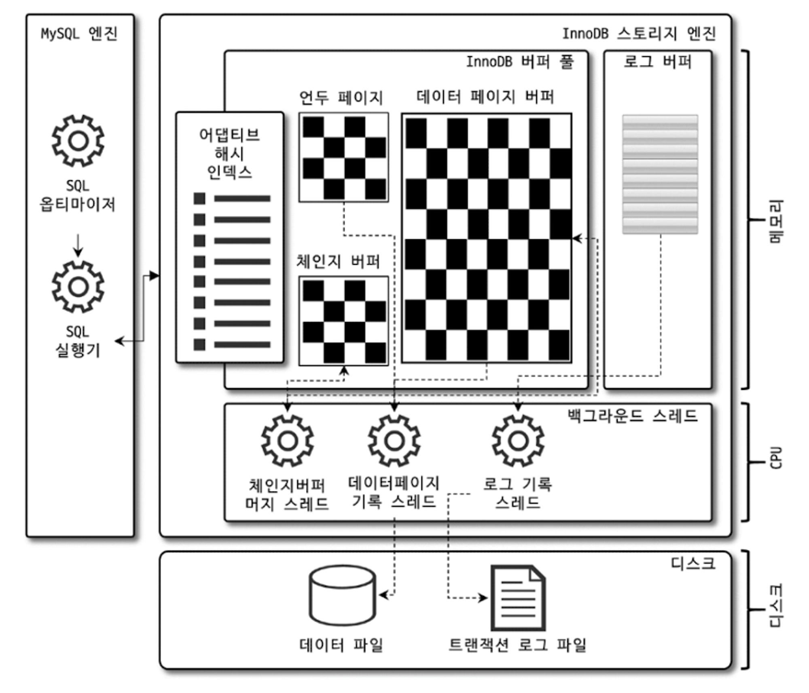
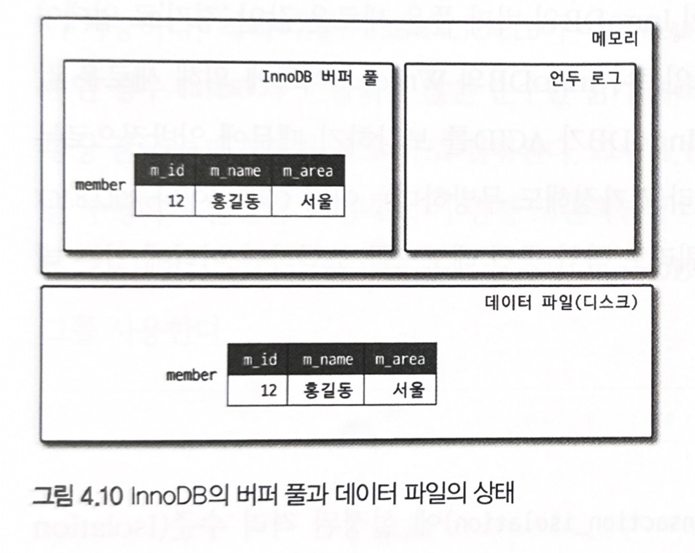
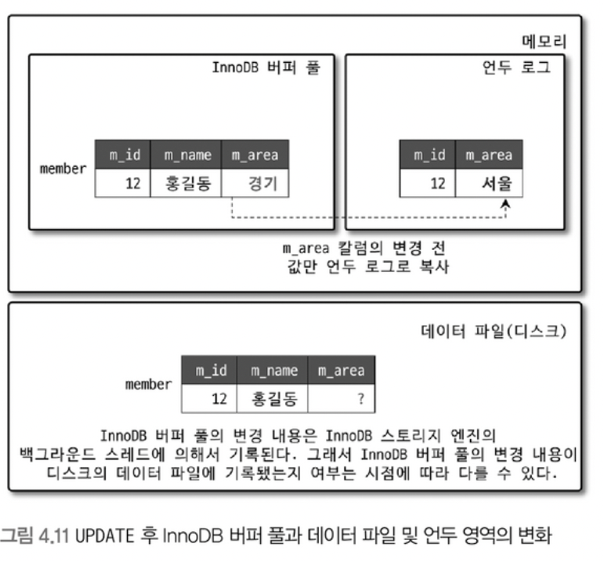
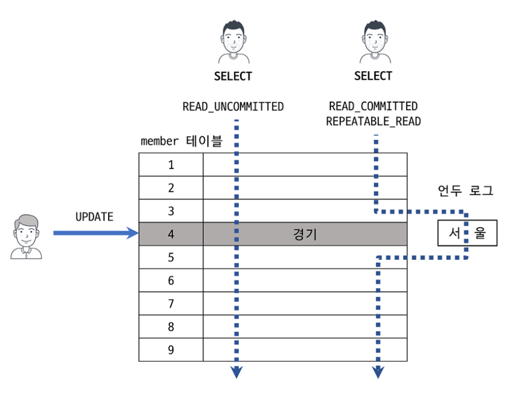
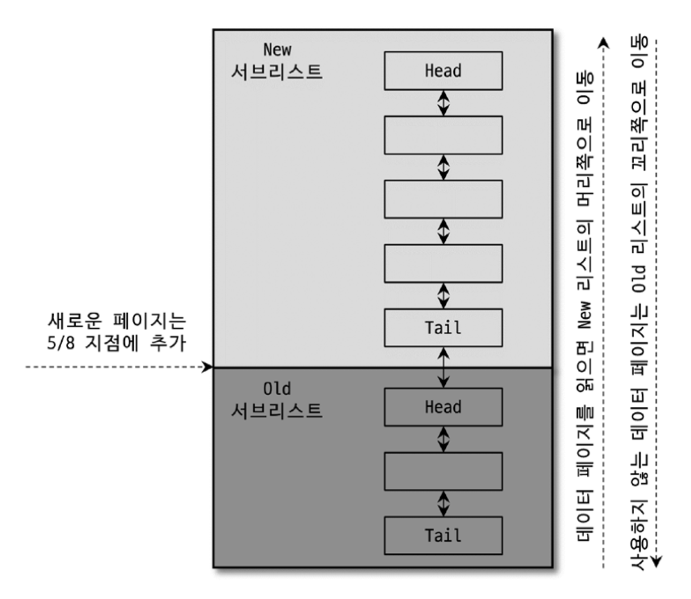
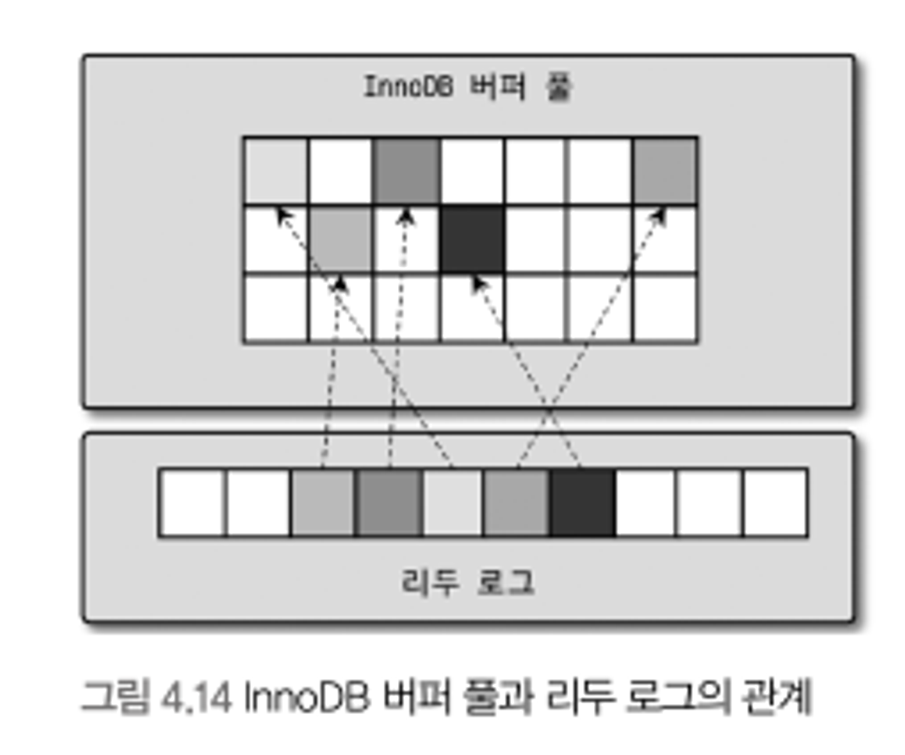

# 4.2 InnoDB 스토리지 엔진 아키텍처

- MySQL의 스토리지 엔진 가운데 가장 많이 사용되는 엔진은 InnoDB 스토리지 엔진이다.
- InnoDB는 MySQL에서 사용할 수 있는 스토리지 엔진 중 거의 유일하게 레코드 기반의 잠금을 제공하며, 그 때문에 높은 동시성 처리가 가능하고 안정적이며 성능이 뛰어나다.

<p align="center">

## 4.2.1 프라이머리 키에 의한 클러스터링

- InnoDB의 모든 테이블은 기본적으로 프라이머리 키를 기준으로 클러스터링되어 저장된다.
- 프라이머리 키 값의 순서대로 디스크에 저장된다는 뜻이며, 모든 세컨더리 인덱스는 레코드의 주소 대신 프라이머리 키의 값을 논리적인 주소로 사용
- 그렇기에 프라이머리 키를 이용한 레인지 스캔은 상당히 빨리 처리된다.
- 그렇기에 쿼리의 실행 계획에서 프라이머리 키는 기본적으로 다른 보조 인덱스에 비해 비중이 높게 설정
- MyISAM 스토리지 엔진은 클러스터링 키를 지원하지 안흔다.
- 그렇기에 MyISAM 테이블에서는 프라이머리 키와 세컨더리 인덱스는 구조적으로 아무런 차이가 없다.
- MyISAM 테이블의 프라이머리 키를 포함한 모든 인덱스는 물리적인 레코드의 주소 값을 가진다.

## 4.2.2 외래 키 지원

- 외래 키의 경우 InnoDB 스토리지 엔진 레벨에서 지원하는 기능으로 MyISAM이나 MEMORY 테이블에서는 사용할 수 없다.
- InnoDB에서 외래 키는 부모 테이블과 자식 테이블 모두 해당 칼럼에 인덱스 생성이 필요하고, 변경 시에는 반드시 부모 테이블이나 자식 테이블에 데이터가 있는지 체크하는 작업이 필요
- 그래서 잠금이 여러 테이블로 전파되고, 그로 인해 데드락이 발생할 때가 많으니 외래 키의 존재에 항상 주의해야함
- 수동으로 데이터를 적재하거나 스키마 변경 등의 관리 작업이 실패할 수 있다.
- 긴급하게 조치를 하거나 해야하는 경우 foreign_key_checks 시스템 변수를 OFF로 설정하면 외래 키 관계에 대한 체크 작업을 일시적으로 멈출 수 있다.
- 외래 키 체크 작업을 일시적으로 멈추면 대략 레코드 적재나 삭제 등의 작업도 부가적인 체크가 필요 없기 때문에 훨씬 빠르게 처리할 수 있다.

 

```sql
mysql> SET foreign_key_checks=OFF;
```

- 외래 키를 일시적으로 해제 했다고 부모와 자식 테이블 간의 관계를 깨진 상태로 두면 안된다.
- 만약 관계를 가진 부모 테이블의 레코드를 삭제했다면 자식 테이블의 레코드 또한 삭제하며 일관성을 맞추고 외래 키 체크 기능을 활성화 해야 한다.
- 그리고  foreign_key_checks 가 비활성화 되면 ON DELETE CASCADE와 ON UPDATE CASCADE 옵션도 무시하게 된다.

## 4.2.3 MVCC(Multi Version Concurrency Control)

- 일반적으로 레코드 레벨의 트랜잭션을 지원하는 DBMS가 제공하는 기능이며, MVCC의 가장 큰 목적은 잠금을 사용하지 않는 일관된 읽기를 제공하는 데 있다.
- InnoDB는 언두 로그를 이용해 이 기능을 구현
- READ_COMMITTED 격리 레벨에서 InnoDB 스토리지 엔진을 사용하는 테이블의 데이터 변경을 어떻게 처리하는지 확인해보자

```sql
mysql> CREATE TABLE member (
				m_id INT NOT NULL,
				m_name VARCHAR(20) NOT NULL,
				m_area VARCHAR(100) NOT NULL,
				PRIMARY KEY(m_id),
				INDEX ix_area(m_area)
				);
mysql> INSERT INTO member (m_id,m_name,m_area) VALUES (12,'홍길동','서울');
mysql> COMMIT;
```

- 위와 같은 동작을 한다면 데이터 베이스의 상태는 아래와 같이 바뀐다.

<p align="center">

- 그리고 update를 한다면

```sql
mysql> UPDATE member SET m_area='경기' WHERE m_id=12;
```

<p align="center">

- Update 문장이 실행되면 커밋 실행 여부와 관계없이 InnoDB의 버퍼 풀은 새로운 값으로 업데이트 된다.
- 디스크의 값은 체크 포인트나 InnoDB의 Write 스레드에 의해 업데이트 되었을 수도 있고 아닐 수도 있다.
- 그럼 Commit이나 Rollback이 되지 않은 상태에서 쿼리로 조회를 한다면 어디에 있는 값을 조회하는걸까?

```sql
mysql> SELECT * FROM member WHERE m_id=12;
```

- MySQL 서버의 시스템 변수에 설정된 격리 수준에 따라 다르다.
- READ_UNCOMMITED인 경우에는 버퍼 풀이 현재 가지고 있는 값을 바로 반환한다.
- 그 이상의 격리 수준(REPEATABLE_READ, READ_COMMITED, SERIALIZABLE)인 경우에는 아직 커밋되지 않았기에 언두 영역의 데이터를 반환한다.
- 이러한 과정은 DBMS에서는 MVCC라고 한다.
- 즉, 하나의 레코드에 대해 2개의 버전이 유지되는 것이다.
- 언두 영역은 더 이상 필요로 하는 트랜잭션이 더는 없을 때 비로소 삭제 된다.(롤백, 커밋 등등)

## 4.2.4 잠금 없는 일관된 읽기(Non-Locking Consistent Read)

- InnoDB 스토리지 엔진은 MVCC 기술을 이용해 잠금을 걸지 않고 읽기 작업을 수행
- 잠금을 걸지 않기에 다른 트랜잭션이 기다리지 않고 읽기 작업이 가능하다.
- 격리 수준이 SERIALIZABLE이 아닌 READ_COMMITTED, READ_UNCOMMITTED, REPEATABLE_READ 수준인 경우 INSERT와 연결되지 않은 순수한 읽기 작업은 잠금 없이 수행한다.

<p align="center">

- 그게 어떻게 가능한가?
    - 언두 로그를 사용하여 읽으면 된다.
- 하지만 이러한 언두 로그로 인해 성능이 저하될 수 있는데 바로 오랜 시간 동안 트랜잭션이 활성 상태라면 언두 로그를 삭제하지 못하고 계속 유지 해야하기 때문이다.
- 그렇기에 빠르게 트랜잭션을 완료하는 것이 좋다.

## 4.2.5 자동 데드락 감지

- InnoDB 스토리 엔진은 교착 상태에 빠지지 않았는지 체크하기 위해 잠금 대기 목록을 그래프(Wait-for List) 형태로 관리한다.
- 데드락 감지 스레드를 가지고 있어서 데드락 감지 스레드가 주기적으로 잠금 대기 그래프를 검사해 교착 상태에 빠진 트랜잭션들 중 하나를 강제로 종료 시킨다.
- 그럼 어느 것을 먼저 강제 종료 시킬까?
    - 언두 로그 양이며, 언두 로그 레코드를 더 적게 가진 트랜잭션이 일반적으로 롤백 대상이 된다.
    - 언두 로그를 적게 가졌다는 의미는 언두 처리를 해야할 일이 적다는 의미이기 때문이다.
- innodb_table_locks 시스템 변수를 활성화하면 InnoDB 스토리지 엔진 내부의 레코드 잠금뿐만 아니라 테이블 레벨의 잠금까지 감지할 수 있다.
    - 비활성화 상태일 때는 상위 레이어인 MySQL 엔진에서 관리되는 테이블 잠금은 볼 수 없어서 감지가 불확실함
- 잠금 목록을 검사해서 데드락 찾아내는건 부담되는 작업은 아니지만 동시 처리 스레드가 많아져 잠금의 개수가 많아지면 데드락 감지 스레드가 느려진다.
- 그럼 데드락 감지 스레드는 어떻게 동작하는가?
    - 잠금 테이블의 정보가 변경되면 안되기에 잠금 테이블에 새로운 잠금을 걸고 데드락을 찾는다.
    - 그럼 기존 서비스 쿼리를 처리 중인 스레드는 작업을 진행하지 못하고 대기한다.
- 이처럼 데드락 감지 스레드의 성능 저하되었을 때의 문제를 해결하기 위해 innodb_deadlock_detect 시스템 변수를 제공하고 이를 OFF로 설정하면 데드락 감지 스레드는 더는 작동하지 않는다.
- 아니면 innodb_lock_wait_timeout 시스템 변수를 활성화하여 데드락 상황에서 일정 시간이 지나면 자동으로 요청이 실해하고 에러 메시지를 반환하게 된다.

## 4.2.6 자동화된 장애 복구

- InnoDB에는 손실이나 장애로부터 데이터 보호를 위한 메커니즘을 가지고 있다.
- 웬만하면 데이터 파일이 손상되거나 MySQL 서버가 시작되지 못하거나 하는 경우는 거의 발생하지 않는다.
- 하지만 MySQL 서버와 무관하게 서버 하드웨어 이슈라면 스토리지 엔진이 자동으로 복구를 못 할 수 있다.
- InnoDB 데이터 파일은 기본적으로 MySQL 서버가 시작될 때 자동으로 복구를 수행하고 만약 복구가 불가능하다면 복구를 멈추고 MySQL 서버를 종료 시킨다.
- innodb_force_recovery 시스템 변수를 설정하면 MySQL 서버가 시작될 때 InnoDB 스토리지 엔진이 데이터 파일이나 로그 파일의 손상 여부 검사 과정을 선별적으로 진행
    - InnoDB의 로그 파일이 손상됐다면 6으로 설정하고 MySQL 서버를 기동
    - InnoDB 테이블의 데이터가 손상됐다면 1로 설정하고 MySQL 서버를 기동
    - 어떤 부분이 문제인지 알 수 없으면 1부터 6까지 변경하면서 재시작을 해본다. 값이 커질 수록 심각한 상황이며 데이터 손실 가능성이 커지고 복구 가능성이 적어진다.
- 만약 1~6까지 진행했음에도 MySQL 서버가 시작되지 않으면 백업을 이용해 다시 구축하는 방법밖에 없다.
- 바이너리 로그를 사용해 최대한 장애 시점까지 복구하는 것이 최선이다.
- 바이너리 로그도 손실되거나 없다면 마지막 백업 시점이 최선이다.

## InnoDB 버퍼 풀

- InnoDB 스토리지 엔진에서 가장 핵심적인 부분
- 디스크의 데이터 파일이나 인덱스 정보를 메모리에 캐시해 두는 공간
- 쓰기 작업을 지연시켜 일괄 작업으로 처리할 수 있게 해주는 버퍼 역할
- 디스크 작업의 횟수를 줄일 수 있다.

### 버퍼 풀의 크기 설정

- 운영체제와 각 클라이언트 스레드가 사용할 메모리를 충분히 고려해서 설정해야 한다.
- MySQL 서버에서 메모리를 필요로하는 부분이 많지 않지만 레코드 버퍼가 상당한 메모리를 사용하기도 한다.
- 레코드 버퍼는 각 클라이언트 세션에서 테이블의 레코드를 읽고 쓸 때 버퍼로 사용하는 공간
- 커넥션이 많고 사용하는 테이블도 많다면 레코드 버퍼 용도로 사용되는 메모리 공간이 꽤 많이 필요
- MySQL 서버가 사용하는 레코드 버퍼 공간은 별도로 설정 x, 전체 커넥션 개수와 각 커넥션에서 읽고 쓰는 테이블의 개수에 따라서 결정
- 또한 이 버퍼 공간은 동적으로 해제되기도 하므로 필요한 메모리 공간의 크기를 계산할 수 없음
- 5.7 버전부터는 버퍼 풀의 크기를 동적으로 조절 가능하고 버퍼 풀의 크기를 적절히 작은 값으로 설정하고 조금씩 증가시키는 것이 최적이다.
- InnoDB 버퍼 풀은 innodb_buffer_pool_size 시스템 변수로 크기를 설정할 수 있으며, 동적으로 버퍼 풀의 크기를 확장 할 수 있다.
- 버퍼 풀은 내부적으로 128MB 청크 단위로 쪼개어 관리한다. 그렇기에 늘리거나 줄일 때 128MB 단위로 처리
- 버퍼 풀 전체를 관리하는 잠금으로 인해 내부 잠금 경합 유발 문제를 해결하기위해 버퍼 풀을 여러 개의 자긍ㄴ 버퍼 풀로 쪼개어 개별 버퍼 풀 전체를 관리하는 잠금 자체도 분산시켰다.
- innodb_buffer_pool_instances 시스템 변수를 이용해 버퍼 풀을 여러 개로 분리해서 관리할 수 있다.

### 버퍼 풀의 구조

- 스토리지 엔진은 버퍼 풀이라는 거대한 메모리 공간을 페이지 크기의 조각으로 쪼개어 데이터를 필요로 할 때 해당 데이터 페이지를 읽어서 각 조각에 저장
- 버퍼 풀의 페이지 크기 조각을 관리하기 위해 LRU(Least Recently Used) 리스트와 플러시(Flush) 리스트, 그리고 프리(Free) 리스트라는 3개의 자료 구조를 관리
- 프리 리스트는 실제 사용자 데이터로 채워지지 않은 비어 있는 페이지들의 목록이며, 사용자의 쿼리가 새롭게 디스크의 데이터 페이지를 읽어와야 하는 경우 사용
- LRU 리스트는, LRU와 MRU(Most Recently Used) 리스트가 결합된 형태
- Old 서브리스트 영역은 LRU에 해당하며, New 서브리스트 영역은 MRU

<p align="center">

- LRU 리스트를 관리하는 목적은 디스크로부터 읽어온 페이지를 최대한 오랫동안 유지해서 디스 읽기를 최소화 하는 것
- 그럼 어떻게 스토리지 엔진에서는 데이터를 찾을까
    1. 필요한 레코드가 저장된 데이터 페이지가 버퍼 풀에 있는지 검사
    2. 디스크에서 필요한 데이터 페이지를 버퍼 풀에 적재하고, 적재된 페이지에 대한 포인터를 LRU 헤더 부분에 추가
    3. 버퍼 풀의 LRU 헤더 부분에 적재된 데이터 페이지가 실제로 읽히면 MRU 헤더 부분으로 이동
    4. 버퍼 풀에 상주하는 데이터 페이지는 사용자 쿼리가 얼마나 최근에 접근했었는지에 따라 나이가 부여되며, 버퍼 풀에 상주하는 동안 쿼리에서 오랫동안 사용되지 않으면 오래된 나이고 결국 해당 페이지는 버퍼 풀에서 제거된다. 만약 쿼리에 의해 사용되면 나이가 초기화되어 다시 젊어지고 MRU의 헤더 부분으로 옮겨진다.
    5. 필요한 데이터가 자주 접근됐다면 해당 페이지의 인덱스 키를 어댑티브 해시 인덱스에 추가
- 처음 한 번 읽힌 데이터 페이지가 이후 자주 사용된다면 오래 살아남을 것이고 아니면 밀려나 제거될 것이다.
- 플러시 리스트는 디스크로 동기화되지 않은 데이터를 가진 데이터 페이지의 변경 시점 기준의 페이지 목록을 관리한다.(더티 페이지)
- 한 번 데이터의 변경이 가해지면 플러시 리스트에 관리되고 특정 시점이 되면 디스크로 기록돼야 한다.
- 데이터가 변경되면 변경 내용은 리두 로그에 기록하고 버퍼 풀의 데이터 페이지에도 변경 내용을 반영한다.
- 그렇기에 각 리두 엔트리는 특정 페이지와 연결

### 버퍼 풀과 리두 로그

- 버퍼 풀은 서버의 메모리가 허용하는 만큼 크게 설정하면 할수록 쿼리의 성능이 빨라진다.
- 버퍼 풀은 데이터베이스 서버의 성능 향상을 위해 데이터 캐시와 쓰기 버퍼링이라는 두 가지 용도가 있다.
    - 그렇기에 메모리 공간만 늘리는 것은 캐시 기능만 향상 시킨다.

<p align="center">

- 버퍼 풀은 전혀 변경되지 않은 클린 페이지와 변경된 더티 페이지를 가진다.
- 더티 페이지는 언젠가는 디스크에 저장되어야 한다.
- 더티 페이지는 무한정 버퍼에 머무를 수 없다.
- 스토리지 엔진에서 리두 로그는 1개 이상의 고정 크기 파일을 연결해서 순환 고리처럼 사용
- 데이터 변경이 계속 발생하면 리두 로그 파일에 기록됐던 로그 엔트리는 어느 순간 다시 새로운 로그 엔트리로 덮어 쓰일 수 있다.
- 그렇기에 스토리지 엔진은 전체 리두 로그 파일에서 재사용 가능한 공간과 당장 재사용 불가능한 공간을 구분해서 관리하고 재사용 불가능한 공간을 활성 리두 로그라고 한다.
- 위 그림에서 화살표를 가진 것인 활성 리두 로그 공간이다.
- 리두 로그 파일의 공간은 계속 순환되어 재사용되지만 매번 기록될 때마다 로그 포지션은 계속 증가된 값을 갖게 되는데, 이를 LSN(Long Sequence Number)이라고 한다.
- 스토리지는 주기적으로 리두 로그와 더티 페이지를 동기화한다.

이 부분은 DB 책을 봐야할듯. 수업 중 배웠던 내용과 비슷

### 버퍼 풀 플러시(Buffer Pool Flush)

- 최근 버전에서는 더티 페이지를 동기화하는 과정에서 디스크 쓰기 폭증 현상은 발생하지 않는다.
- InnoDB 스토리지 엔진은 버퍼 풀에서 아직 디스크로 기록되지 않은 더티 페이지들을 성능상의 악영향 없이 디스크에 동기화하기 위해 2개의 플러시 기능을 백그라운드로 실행
    - 플러시 리스트 플러시
    - LRU 리스트 플러시

### 플러시 리스트 플러시

- 주기적으로 플러시 리스트 플러시 함수를 호출해서 플러시 리스트에서 오래전에 변경된 데이터 페이지 순서대로 디스크에 동기화하는 작업을 수행한다.(오래된 놈들을 제거를 해야하는데 제거하기 전에 동기화를 거쳐야하기 때문)
- 언제부터 얼마나 많은 더티 페이지를 한 번에 디스크로 기록하는가도 중요하다. 이를 위해 다음과 같은 시스템 변수들을 제공
    - innodb_page_cleaners
    - innodb_max_dirty_pages_pct_lwm
    - innodb_max_dirty_pages_pct
    - innodb_io_capacity
    - innodb_io_capacity_max
    - innodb_flush_neighbors
    - innodb_adaptive_flushing
    - innodb_adaptive_flushing_lwm
- 더티 페이지를 디스크로 동기화하는 스레드를 클리너 스레드라고 하는데 이걸 innodb_page_cleaners로 스레드 개수 조정 가능
- 버퍼 풀은 클린 페이지뿐만 아니라 사용자의 DML에 의해 변경된 더티 페이지도 함께 가지고 있다.
- 무한정 더티 페이지를 유지할 수 없다.
- 더티 페이지의 비율 조정은 innodb_max_dirty_pages_pct로 설정이 가능하다.
- 일반적으로 버퍼 풀은 더티 페이지를 많이 가지고 있을수록 디스크 쓰기 작업을 버퍼링함으로써 여러 번의 디스크 쓰기를 한 번으로 줄이는 효과를 극대화할 수 있다. 그러니 기본값을 유지하자
- 하지만 더티 페이지가 많을수록 디스크 쓰기 폭발(Disk IO Burst) 현상이 발생할 가능성이 높아진다.
- innodb_io_capacity 값을 기준으로 더티 페이지 ㅆ,기를 실행
- 한 번에 저장되는 것을 막기 위해 innodb_max_dirty_pages_pct_lwm 값을 통해 정해진 비율 이상이면 조금씩 디스크에 저장하게 한다.
- InnoDB 스토리지에서는 어댑티브 플러시 기능을 제공하여 플러시 작업을 조절하는 알고리즘을 제공한다.
- innodb_flush_neighbors 변수를 활용하여 디스크에 기록할 때 디스크에서 근접한 페이지 중에서 더티 페이지가 있다면 묶어서 기록할 수 있게 해준다.
    - HDD에서는 많이 사용한 기술이지만 SDD에서는 비활성화를 유지하자.

### LRU 리스트 플러시

- LRU 리스트에서 사용 빈도가 낮은 데이터 페이지들을 제거해서 새로운 페이지들을 읽어올 공간을 만들어야 할 때, LRU 리스트 플러시 함수를 사용한다.
- 더티 페이지를 동기화하고 클린 페이지는 즉시 프리 리스트로 페이지를 옮긴다.

### 버퍼 풀 상태 백업 및 복구

- 버퍼풀은 쿼리 성능에 매우 중요하다. 그렇기에 재실행을 하게 되면 원래의 성능보다 현저히 떨어지게 된다.
- 그러면 버퍼 풀에 쿼리들이 사용할 데이터가 이미 준비되어 있다면 될 것이다.
- 이렇게 디스크의 데이터가 버퍼풀에 적재돼 있는 상태를 워밍업이라고 표현한다.
- MySQL 서버를 셧다운하기 전에 innodb_buffer_pool_dump_now 시스템 변수를 이용해 현재 InnoDB 버퍼 풀의 상태를 백업할 수 있다.

```sql
-- // MySQL 서버 셧다운 전에 버퍼 풀의 상태 백업
mysql> SET GLOBAL innodb_buffer_pool_dump_now=ON;

-- // MySQL 서버 재시작 후, 백업된 버퍼 풀의 상태 복구
mysql> SET GLOBAL innodb_buffer_pool_load_now=ON;
```

- InnoDB 버퍼 풀의 백업은 데이터 디렉터리에 ib_buffer_pool이라는 이름의 파일로 생성되는데, 실제 이 파일의 크기를 보면 아무리 버퍼 풀이 크다 하더라도 몇십 MB 이하인 것을 확인할 수 있다.
    - 버퍼풀의 LRU 리스트에서 적재된 데이터 페이지의 메타 정보만 가져와서 저장하기 때문
- 저장은 매우 빨라, 크기가 작으니까. 하지만 복구는 상당한 시간이 걸린다. 왜냐면 디스크에서 해당 메타데이터를 이용해 다시 읽어와야하기 때문에
- 위는 수동으로 처리하는 것이고 만약 자동으로 처리하고 싶다면 innodb_buffer_pool_dump_at_shutdown과 innodb_buffer_pool_load_at_startup 설정을 MySQL 서버의 설정 파일에 넣어두면 된다.

### 버퍼 풀의 적재 내용 확인

- MySQL 서버의 information_schema 데이터베이스의 innodb_buffer_page 테이블을 이용해 InnoDB 버퍼 풀의 메모리에 어떤 테이블의 페이지들이 적재돼 있는지 확인 가능
- 버퍼 풀이 큰 경우에는 조회에 부하가 커서 서비스 쿼리가 느려짐
- 8.0부터는 이러한 문제를 해결하기 위해 innodb_cached_indexes 테이블이 추가되었다.
- 테이블의 인덱스별로 데이터 페이지가 얼마나 InnoDB 버퍼 풀에 적재돼 있는지 확인 가능